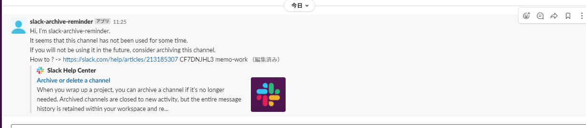

[日本語](README.md) | [English](README.en.md)

# slack-archive-reminder

This is a script to send an archive message to channels that have not been used for a while in Slack.



# How to use

## Create Your Slack App

Go to https://api.slack.com/apps and create a new app from `Create New App` with _scratch_. 
Of course, you can also use existing apps.  

In the App that you created
 - Basic Infomation -> Display Information -> App Name, Short Descrioption, Backgroud color with any content.
 - OAuth & Permissions -> From Scopes, set the following scopes
   - Bot Token Scopes
     - chat:write
     - chat:write.public
   - User Token Scopes
     - channels:history
     - channels:read
     - groups:history
     - groups:read

Once you have completed the above, install the App on the workspace you wish to use. User OAuth Token and Bot User OAuth Token will be generated. Keep this information in a safe place.  

## Set this repo to your server

### prepare

Clone this repository on the server you want to use it on.  
```
$ git clone https://github.com/mollinaca/slack-archive-reminder.git
$ cd slack-archive-reminder
```

Create and edit the config.ini file.
```
$ cp config.ini.example config.ini
```

### About the contents of config.ini

In the example file, you will find the following
```
[slack]
user_token=xoxp-<YOUR_SLACK_USER_TOKEN>
bot_token=xoxb-<YOUR_SLACK_BOT_TOKEN>
threshold = 2592000  # [sec], 2592000 sec means 30 days
exclude_list = ['general','random']
debug_channel = xxxxxxxx
bot_message = Hi, I'm slack-archive-reminder.
    It seems that this channel has not been used for some time.
    If you will not be using it in the future, consider archiving this channel.
    How to ? -> https://slack.com/help/articles/213185307

```
 - Set *user_token* to the User OAuth Token of the Slack APP
 - Set *bot_token* to the Bot User OAuth Token of the Slack APP
 - Set *threshold* to the threshold to send a reminder if no one has spoken for longer than this number of seconds. The default value is _259200_, which means 30 days.
 - In *exclude_list*, enter the name of the channel you want to exclude from the remind list. If there is no target to exclude, leave it as an empty list [].
 - For *debug_channel*, if you want to check the behavior in advance, specify the ID of a channel that you do not mind being mentioned.If this is set and the `DEBUG` variable set inside _main.py_ is set to _True_, a message prompting for archiving will be posted to the channel specified by _debug_channel_.
 - For *bot_message*, set a message to prompt for archiving or to post to the channel. If you are fine with the default, use it as is.


### pip install or pipenv shell

This script uses a pip module, python-slack-sdk.
Please follow the steps below to install the software.

```
$ pip install slack_sdk
```
For more information about slack_sdk, check out _ref_.
If pipenv is enabled, it will be executed by the bundled `Pipfile`.  
Note: pipenv has been tested with python version `3.9.6`.  
```
$ pipenv shell
Launching subshell in virtual environment…
 . /root/.local/share/virtualenvs/slack-archive-reminder-nUILTd8E/bin/activate

$ python --version
Python 3.9.6
(slack-archive-reminder)
```

### Run

Run `main.py`.  
If an error occurs when executing the SlackAPI, it will output the error details to the standard error output and exit.  
Please refer to the Slack API documentation for the error details.  
It can also be executed periodically using _cron_, etc.  


# refs

https://github.com/slackapi/python-slack-sdk  
https://api.slack.com/methods/conversations.list  
https://api.slack.com/methods/conversations.history  
https://api.slack.com/methods/chat.postMessage  
